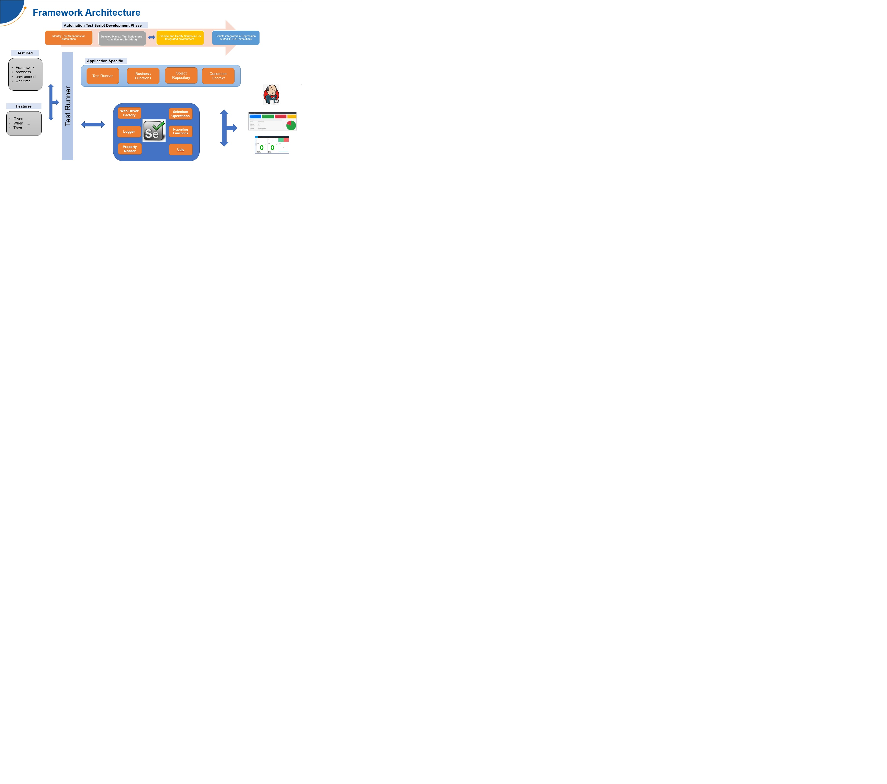

# Web Automation Framework #
Purpose of this README is to provide overview of framework, how to get framework from GitHub, environment required, how
to execute scenarios, view report and brief about framework architecture.
### Overview: ###
Framework is developed by using Selenium-Cucumber-java.
* WebDriverManager is used which carries out the management (i.e., download, setup, and maintenance) of the drivers required by Selenium WebDriver.
* Cucumber is used to supports behavior-driven development. Cucumber BDD approach is its ordinary language parser called Gherkin.
* Courgette is used for parallel execution and cucumber report generation.
* Dependency injection for test data context.
### Tools Integrated: ###
* Selenium
* Playwright(Work in progress)
* Appium(Work in progress)
* WinApp Driver(Work in progress)
* Rest Assured
* Sikuli
### Feature: ###
* Supports cucumber and testng framework.
* Test Reporting using Courgette Cucumber Report and Extent Reports.
* Test Data Generator.
* Dependency Injection for test data sharing between scenarios.
* Take snapshot for all steps.

### Framework Architecture: ###

### Framework Description: ###
<ul id="myUL">
<li>src
<ul class="nested">
<li>test
<ul class="nested">
<li>java</li>
<ul class="nested">
<li>framework</li>
<ul class="nested">
<li><strong>engine</strong> - Intialize webdriver and related selenium operations</li>
<li><strong>exception</strong> - Exception handling</li>
<li><strong>log</strong> - Execution log</li>
<li><strong>reader</strong> - Read properties file</li>
<li><strong>report</strong> - Report generation/management</li>
<li><strong>utils</strong> - Generic utilities</li>
</ul>
<li>test</li>
<ul class="nested">
<li><strong>businessfunctions</strong> - UI workflow functions</li>
<li><strong>constant</strong> - Data constant</li>
<li><strong>cucumbercontext</strong> - Test Data sharing between scenarios</li>
<li><strong>locators</strong> - UI page wise object locators</li>
<li><strong>stepdef</strong> - Step definition mapping for feature file</li>
<li><strong>testcases</strong> - Cucumber TestRunner</li>
</ul>
</ul>
<li>resources</li>
    <ul class="nested">
        <li><strong>features</strong> - Scenario feature file</li>
        <li><strong>properties</strong> - Log4j and TestBed properties</li>
    </ul>
</ul>
</li>
</ul>
  </li>
</ul>
<ul id="myUL">
    <li>testreport
        <ul class="nested">
            <li>cucumber
            <ul class="nested">
                <li><strong>latest</strong> - latest executed report</li>
                <li><strong>history</strong> - previous execution reports</li>
            </ul>
          </li>
        </ul>
    </li>
</ul>

### Repository URL: ###
https://github.com/pawankrdwivedi/web_automation
 Click on Code button and choose option to download framework
### Pre-requisite (IDE and Test Bed): ###
* IntelliJ IDEA 2021.2.1 (Community Edition)
* JDK 1.8
* Chrome browser
### Execute Test: ###
<h6>Using TestRunner:</h6> TestRunner.java file is available on below path - <i>src/test/java/com/web/automation/test/testcases/cucumber/ToDoMVCTestRunner.java</i>  Mouse right click and choose option Run ToDoMVCTestRunner 
<h6>Using command-line:</h6>
Open Intellij IDE terminal (Alt + F12). Execute command: <b>mvn clean test</b>
### Check Test Report: ###
<h6>Latest Report:</h6> .\testreport\cucumber\latest\courgette-report 
<h6>Report History:</h6> .\testreport\cucumber\history\courgette-report 
### Test Scenarios: ###
There are six scenarios created in feature file and their steps are defined in step definition file.
<h6>Feature File -</h6> .\src\test\resources\features\ToDoMVC.feature  
<h6>Step Definition File -</h6> .\src\test\java\com\web\automation\test\stepdef\ToDoMVCSteps.java  
<h6>Scenario Outlines -</h6>
<table>
<tr>
<th>Scenario</th>
<th>Objective</th>
</tr>
<tr><td> Add an item in ToDo list.</td><td>User is able to add an item in ToDo list.</td></tr>
<tr><td> Mark an added item in ToDo list as 'Complete'.</td><td>User is able to mark an item as 'complete' in ToDo list.</td></tr>
<tr><td> Mark a completed item in ToDo list as 'Active'.</td><td>User is able to mark a complete item as 'Active' by clicking again in ToDo list.</td></tr>
<tr><td> Delete an item from ToDo list.</td><td>User is able to delete an item from ToDo list.</td></tr>
<tr><td> Add multiple items in ToDo List.</td><td>User is able to add multiple items in ToDo list.</td></tr>
<tr><td> Apply 'Active'/'Completed' filter and verify count in ToDo list.</td><td>User is able to apply 'Active'/'Completed' filters and match count for same in ToDo list.</td></tr>
</table>
